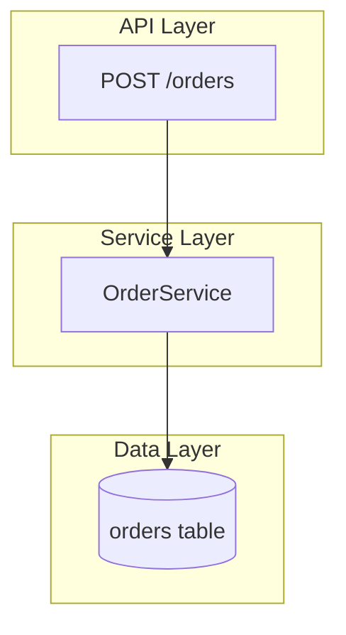

# HTML Patterns

Concrete implementation for a Mermaid-based interactive artifact. These are patterns to
adapt, not a template to copy verbatim — keep the file self-contained and buildless. The
example below uses a request flow to illustrate the wiring; the same patterns apply to
any content.

## CDN Stack

Load everything from CDN so the file opens with no install step.

```html
<script src="https://cdn.jsdelivr.net/npm/mermaid@11/dist/mermaid.min.js"></script>
<script src="https://cdn.tailwindcss.com"></script>
<!-- Shiki is ESM; import it inside a module script -->
<script type="module">
  import { codeToHtml } from 'https://esm.sh/shiki@1';
  window.codeToHtml = codeToHtml;
</script>
```

Tailwind's CDN build is fine for an artifact (it warns in console; ignore for static
use). React is optional — plain DOM is enough for the click-to-panel pattern below.

## Mermaid Config

Initialize once, with manual start so you control render timing and keep node IDs
stable for click callbacks.

```html
<script>
  mermaid.initialize({
    startOnLoad: false,
    theme: matchMedia('(prefers-color-scheme: dark)').matches ? 'dark' : 'default',
    securityLevel: 'loose', // required for click callbacks to fire
    flowchart: { curve: 'basis', nodeSpacing: 50, rankSpacing: 60 },
  });
  await mermaid.run({ querySelector: '.mermaid' });
</script>
```

`securityLevel: 'loose'` is what lets `click` directives call your JS. Without it,
callbacks are silently dropped.

## Diagram with Clickable Nodes

Define the graph and bind each node to a handler. Subgraphs draw the boundaries.



The third argument is the node key you look up in your detail data.

## Detail Panel

Hold per-node detail in a JS map; the callback fills and reveals a side panel.

```js
const DETAIL = {
  route: {
    title: 'POST /orders',
    desc: 'Entry point. Validates the payload, then hands off to OrderService.',
    files: ['src/api/orders.ts:14'],
    code: `app.post('/orders', validate(orderSchema), async (req, res) => {
  const order = await orderService.create(req.body);
  res.status(201).json(order);
});`,
    lang: 'typescript',
  },
  // orderSvc, orderRepo, ...
};

async function showDetail(key) {
  const d = DETAIL[key];
  if (!d) return;
  document.getElementById('panel-title').textContent = d.title;
  document.getElementById('panel-desc').textContent = d.desc;
  document.getElementById('panel-files').innerHTML =
    d.files.map(f => `<code>${f}</code>`).join('<br>');
  document.getElementById('panel-code').innerHTML =
    await window.codeToHtml(d.code, { lang: d.lang, theme: 'vitesse-dark' });
  document.getElementById('panel').classList.add('open');
}
```

`showDetail` must be on `window` (a top-level `function showDetail` works) so Mermaid's
loose-mode callback can reach it.

## Pan and Zoom

Wrap the diagram in a transform layer for larger graphs.

```js
let scale = 1, tx = 0, ty = 0, dragging = false, sx, sy;
const stage = document.getElementById('stage'); // contains the .mermaid svg
const apply = () => stage.style.transform =
  `translate(${tx}px, ${ty}px) scale(${scale})`;

stage.parentElement.addEventListener('wheel', e => {
  e.preventDefault();
  scale = Math.min(3, Math.max(0.3, scale - e.deltaY * 0.001));
  apply();
}, { passive: false });

stage.parentElement.addEventListener('pointerdown', e => {
  dragging = true; sx = e.clientX - tx; sy = e.clientY - ty;
});
window.addEventListener('pointermove', e => {
  if (!dragging) return; tx = e.clientX - sx; ty = e.clientY - sy; apply();
});
window.addEventListener('pointerup', () => dragging = false);
```

Let clicks still reach nodes — only treat motion past a small threshold as a drag if
you find clicks getting swallowed.

## Mobile

Set the viewport so the diagram scales to the device:

```html
<meta name="viewport" content="width=device-width, initial-scale=1">
```

The pointer handlers above already give one-finger pan. `wheel` does not fire on touch,
so add pinch-zoom from two active pointers:

```js
const pts = new Map();
let pinchDist = 0;
stage.parentElement.addEventListener('pointerdown', e => pts.set(e.pointerId, e));
stage.parentElement.addEventListener('pointermove', e => {
  if (!pts.has(e.pointerId)) return;
  pts.set(e.pointerId, e);
  if (pts.size === 2) {
    const [a, b] = [...pts.values()];
    const d = Math.hypot(a.clientX - b.clientX, a.clientY - b.clientY);
    if (pinchDist) {
      scale = Math.min(3, Math.max(0.3, scale * (d / pinchDist)));
      apply();
    }
    pinchDist = d;
  }
});
window.addEventListener('pointerup', e => { pts.delete(e.pointerId); pinchDist = 0; });
```

Render the detail panel as a side panel on wide screens and a bottom sheet on narrow
ones — a Tailwind breakpoint (`md:`) on the panel container covers both. Keep tap targets
(nodes, close button) at least ~44px so they're reliable with a finger.

## Theme

Render correctly in both light and dark — don't hardcode a dark palette. Drive the chrome
(background, surface, text) from `prefers-color-scheme` or CSS variables so it follows the
viewer's system.

For diagram colors, follow `/md-validation` (`resources/mermaid-authoring.md`): default to
renderer theme colors, and for emphasis use a stroke-only `classDef` (no fill) so nodes
adapt to any background. Reserve one accent for flagged nodes, applied as stroke plus a
label so callouts read in either mode.

## Serve Over Tailscale (optional)

To view the artifact on another device — a phone, to check the mobile layout — serve the
folder over your tailnet. Only offer this if Tailscale is present: `command -v tailscale`.

```bash
cd <artifact-folder>
PORT=$(python3 -c 'import socket; s=socket.socket(); s.bind(("",0)); print(s.getsockname()[1]); s.close()')
python3 -m http.server "$PORT" &
tailscale serve --bg "$PORT"
```

`tailscale serve` proxies HTTPS on your tailnet (always port 443, regardless of `$PORT`)
to `localhost:$PORT` and prints a `https://<machine>.<tailnet>.ts.net` URL that opens on
any device signed into the same tailnet. It stays private to the tailnet — use
`tailscale funnel` only to expose it publicly, which is rarely what you want for a working
artifact. Tear down with `tailscale serve --bg "$PORT" off`.
