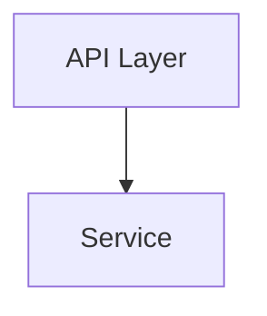
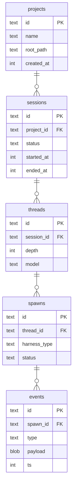

# Diagrams

Use when information has relationships, dependencies, or flow: after the prose
it illustrates, never instead of it. Validate with `meridian mermaid check`.

## Mermaid (default)

Use Mermaid for flowcharts, dependency graphs, and system maps. For force-directed
layouts or network graphs, see Cytoscape below.

### CDN

```html
<script src="https://cdn.jsdelivr.net/npm/mermaid@11/dist/mermaid.min.js"></script>
```

Use the `dist/mermaid.min.js` IIFE: it exposes the `mermaid` global and
vendors cleanly for offline use (the ESM entry pulls further imports at
runtime).

### Config

Initialize with manual start for stable node IDs and click callbacks.

```js
mermaid.initialize({
  startOnLoad: false,
  theme: document.documentElement.classList.contains('dark') ? 'dark' : 'default',
  securityLevel: 'loose',  // required for click callbacks
  flowchart: { curve: 'basis', nodeSpacing: 50, rankSpacing: 60 },
});
await mermaid.run({ querySelector: '.mermaid' });
```

`securityLevel: 'loose'` lets `click` directives call your JS. Without it, callbacks
are silently dropped.

When the viewer toggles theme, re-initialize Mermaid with the new theme and re-render
the diagram.

### Click Callbacks

Two approaches: use whichever fits your graph:

**Mermaid `click` directives** (simpler, requires valid JS identifiers as node IDs):



**Post-render DOM binding** (works with any node ID):

```js
document.querySelectorAll('#diagram .node').forEach(node => {
  node.style.cursor = 'pointer';
  node.addEventListener('click', () => {
    const id = node.id.replace(/^flowchart-/, '').replace(/-\d+$/, '');
    showDetail(id);
  });
});
```

### Detail Data

Hold per-node detail in a JS object; the callback fills the detail sidebar from
`layout-and-theme.md`.

```js
const DETAIL = {
  api: {
    title: 'API Layer',
    desc: 'Entry point. Validates payload, hands off to service.',
    files: ['src/api/orders.ts:14'],
    code: `app.post('/orders', validate(schema), handler);`,
    lang: 'typescript',
  },
};

function showDetail(key) {
  const d = DETAIL[key]; if (!d) return;
  document.getElementById('detail-title').textContent = d.title;
  document.getElementById('detail-desc').textContent = d.desc;
  if (d.code && window.hljs) {
    document.getElementById('detail-code').innerHTML =
      `<pre><code>${hljs.highlight(d.code, { language: d.lang }).value}</code></pre>`;
  }
  document.getElementById('detail-panel').classList.remove('collapsed');
}
```

`showDetail` must be on `window` (a top-level `function` declaration) so Mermaid's
loose-mode callback can reach it.

### Pan and Zoom

Default for any diagram with 6+ nodes. Wrap the Mermaid container in a
transform layer with pointer-drag panning, scroll-wheel zoom, and a
fullscreen toggle button. Without this, larger diagrams are unreadable.

```js
let scale = 1, tx = 0, ty = 0, dragging = false, sx, sy;
const stage = document.getElementById('stage');
const apply = () => stage.style.transform =
  `translate(${tx}px,${ty}px) scale(${scale})`;

stage.parentElement.addEventListener('wheel', e => {
  e.preventDefault();
  scale = Math.min(3, Math.max(0.3, scale - e.deltaY * 0.001));
  apply();
}, { passive: false });

stage.parentElement.addEventListener('pointerdown', e => {
  dragging = true; sx = e.clientX - tx; sy = e.clientY - ty;
});
window.addEventListener('pointermove', e => {
  if (!dragging) return; tx = e.clientX - sx; ty = e.clientY - sy; apply();
});
window.addEventListener('pointerup', () => dragging = false);
```

Add a controls bar (zoom +/−, reset, fullscreen) positioned absolute top-right
of the container. Fullscreen toggles `position: fixed; inset: 0` on the
container; Escape exits. Add pinch-zoom for mobile:

```js
const pts = new Map();
let pinchDist = 0;
stage.parentElement.addEventListener('pointerdown', e => pts.set(e.pointerId, e));
stage.parentElement.addEventListener('pointermove', e => {
  if (!pts.has(e.pointerId)) return;
  pts.set(e.pointerId, e);
  if (pts.size === 2) {
    const [a, b] = [...pts.values()];
    const d = Math.hypot(a.clientX - b.clientX, a.clientY - b.clientY);
    if (pinchDist) {
      scale = Math.min(3, Math.max(0.3, scale * (d / pinchDist)));
      apply();
    }
    pinchDist = d;
  }
});
window.addEventListener('pointerup', e => { pts.delete(e.pointerId); pinchDist = 0; });
```

### Entity-Relationship Diagrams

Use Mermaid's `erDiagram` type for database schema visualization in design docs.
Entities show typed attributes with PK/FK markers; relationships use cardinality
notation.



**Cardinality notation:**

| Syntax | Meaning |
|--------|---------|
| `\|\|--o{` | one to zero-or-many |
| `\|\|--\|\|` | one to one |
| `}o--o{` | zero-or-many to zero-or-many |
| `\|\|--\|{` | one to one-or-many |

**Tips:**
- Empty string `""` as the relationship label hides the label text
- Attribute lines: `type name [PK|FK|UK]` — constraint keyword is optional
- Keep entity count under ~12 per diagram; split into domain subgraphs for larger schemas
- Works with the same theme toggle and re-render pattern as flowcharts

For interactive schema exploration at scale (pan/zoom on individual columns,
expand/collapse attribute lists), consider GoJS via CDN
(`https://cdn.jsdelivr.net/npm/gojs@2/release/go.js`) which has a purpose-built
ERD sample. Use Mermaid first; upgrade only when the diagram exceeds ~15 entities
or needs column-level click interaction.

### Diagram Styling

Default to renderer theme colors. Use stroke-only `classDef` for emphasis so nodes
adapt to any background:

```text
classDef highlight stroke:#f59e0b,stroke-width:2px
```

Reserve one accent for flagged nodes, applied as stroke plus a label.

## Cytoscape (alternative)

Use Cytoscape.js when you need force-directed layout, network visualization, or
richer interaction than Mermaid supports. ~136 KB gzipped.

```html
<script src="https://cdn.jsdelivr.net/npm/cytoscape@3/dist/cytoscape.min.js"></script>
```

```js
const cy = cytoscape({
  container: document.getElementById('graph'),
  elements: [
    { data: { id: 'a', label: 'API' } },
    { data: { id: 'b', label: 'DB' } },
    { data: { source: 'a', target: 'b' } },
  ],
  style: [
    { selector: 'node', style: { label: 'data(label)', 'background-color': '#467' } },
    { selector: 'edge', style: { width: 2, 'target-arrow-shape': 'triangle' } },
  ],
  layout: { name: 'breadthfirst' },
});
cy.on('tap', 'node', e => showDetail(e.target.data('id')));
```

Cytoscape has built-in zoom, pan, and box selection. Layouts: `breadthfirst`,
`circle`, `cose` (force-directed), `grid`.
